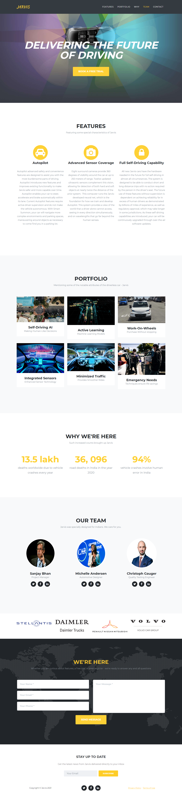

# Jarvis - Driverless Car
This is a repository for the single page website - Jarvis, the Driverless Car, developed using HTML, CSS &amp; JS. 

# Technologies
* Bootstrap
* Font Awesome
* Google Fonts

# Project Link
https://barunipriyats.github.io/DriverlessCarSinglePageWebsite/

# Screen Capture

